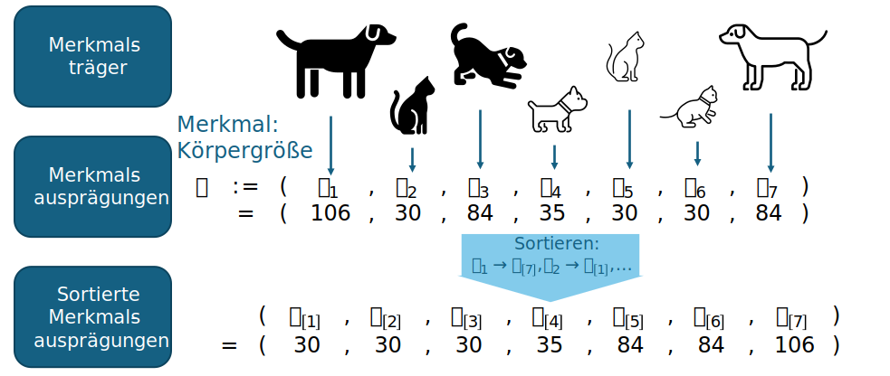

# Deskriptive Statistik

Ziel der deskriptiven Statistik ist es, eine große Menge von Daten, mit möglichst wenigen Kennzahlen
aussagekräftig zu beschreiben.

Wir werden dazu verschieden Maßzahlen kennenlerne, mit denen wir uns ein Vokabular aufbauen.
Dann muss Unterschiede und Ähnlichkeiten verschiedener Datensätze nicht mehr bildhaft umschrieben werden,
sondern können klar durch diese Kennzahlen kommuniziert werden.

Eine gute Kenntnis über die Kennzahlen der Deskriptiven Statistik und deren Bedeutung
hilft dabei Trends in Daten zu erkenne (z.B. wie ändert sich das Kaufverhalten mit einer Wetterverschlechterung?)
und ermöglicht es präzise mit Kollegen über diese zu sprechen und so fundierte administrative Entscheidungen zu treffen.

## Merkmale, Merkmalsträger und Merkmalsausprägungen

Es ist nützlich sich auf bestimmte Vokabeln zu einigen, damit wir präzise über die Daten sprechen
können, mit denen wir arbeiten.

* Ein **Merkmal** ist eine bestimmte Eigenschaft, die wir messen wollen. 
  * Merkmal: "Haarfarbe"
  * Merkmal: "Alter"
  * Merkmal: "T-Shirt Größe"
* Bei einem Merkmal können wir verschiedene Ausprägungen erwarten, diese werden **Merkmalsausprägung** genannt.
  * Merkmalsausprägungen zum Merkmal "Haarfarbe": "blond", "brünet", "rot", ...
  * Merkmalsausprägungen zum Merkmal "Alter": 0, 1, 2, ...
  * Merkmalsausprägungen zum Merkmal "T-Shirt Größe": "XXS", "XS", "S", "M", "L", "XL", "XXL", "XXXL"
* Der **Merkmalsträger** ist das Objekt, dass die Merkmale aufweist.
  * Der Mensch ist der Merkmalsträger der Merkmale "Haarfarbe", "Alter" und "T-Shirt Größe" (und natürlich noch vieler weiterer).

!!! info "Vokabeln"

    Die interessante Eigenschaft ist das **Merkmal**.
    
    Die konkreten Werte der interessanten Eigenschaft sind die **Merkmalsausprägung**.
    
    Das Ding mit der interessanten Eigenschaft ist der **Merkmalsträger**.

{{ task(file="tasks/deskriptive_statistik/merkmal_vokabeln_identifizieren.yaml") }}

{{ task(file="tasks/deskriptive_statistik/merkmal_ausprägungen_finden.yaml") }}