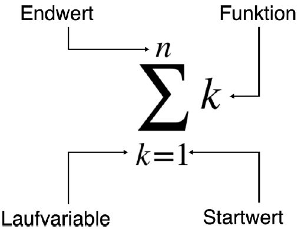

# Summenzeichen

{{ youtube_video("https://www.youtube.com/embed/vikXOuevyZc?si=Em4eVh1PBlnuo56F") }}

Eine Addition von mehreren Zahlen kann vereinfacht mit dem Summenzeichen dargestellt werden. 
Das Summenzeichen ist der große griechische Buchstabe Epsilon.

$$
\sum_{k=1}^{n}k = 1+2+3+4+\cdots + n
$$

Hier siehst du die einzelnen Bestandteile des Summenzeichens:

Start und Endwert müssen ganze Zahlen sein. Wenn der Startwert größer als der Endwert ist,
ist der Summenwert $0$.

_Beispiel_

\begin{align*}
\sum_{k=0}^{5}k^2 &= 0^2+1^2+2^2+3^2+4^2+5^2 \\
 &= 0+1+4+9+16+25 \\
 &= 55
\end{align*}

{{ task(file="tasks/lineare_funktionen/summenzeichen_finden.yaml") }}

{{ task(file="tasks/lineare_funktionen/summenzeichen_auflösen.yaml") }}

# Indexschreibweise

{{ youtube_video("https://www.youtube.com/embed/H_VSCzHclkw?si=gAH2SWtys7yo3zhe") }}

nach Summenfunktion müssen die einzelnen Summenglieder nicht zwangsläufig einen expliziten Zahlenwert besitzen.
In der folgenden Summe werden die Glieder $a_0$ bis $a_n$ aufsummiert

$$
\sum_{k=0}^{n}a_k = a_1 + a_2 + \cdots + a_n
$$

_Beispiel_

Acht Leute spenden einen anonym einen Geldbetrag. Die Beträge werden als $x$ mit einem Index notiert:

| Spendenbetrag | Wert  |
|---------------|-------|
| $x_1$         | $10$  |
| $x_2$         | $25$  |
| $x_3$         | $5$   |
| $x_4$         | $30$  |
| $x_5$         | $20$  |
| $x_6$         | $80$  |
| $x_7$         | $15$  |
| $x_8$         | $100$ |
 
$$
\sum_{i=1}^{8}x_i = x_1 + x_2 + x_3 + x_4 + x_5 + x_6 + x_7 + x_8 = 285
$$

