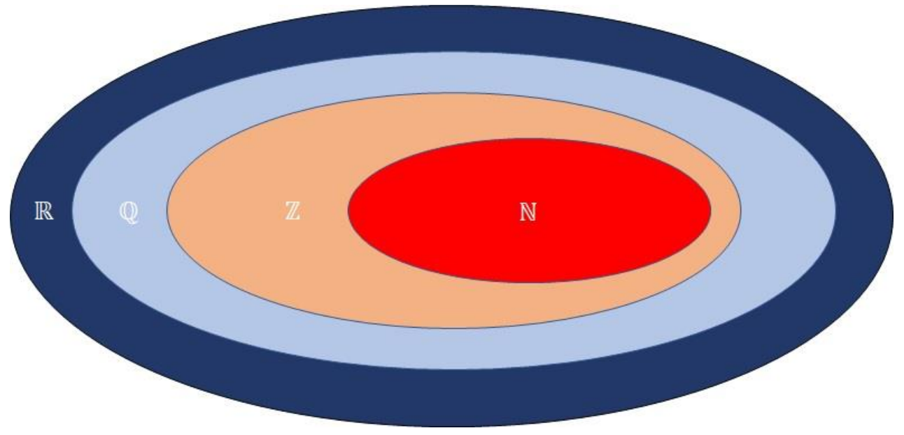

# Mengenlehre

Eine **Menge** ist eine Sammlung von Objekten. Das klingt erst mal sehr banal,
bildet aber den Grundbaustein der Mathematik.

Im Folgenden werden wir kennenlernen, was es für Mengen gibt, wie wir diese aufschreiben können
und warum sie für uns nützlich sind.

## Grundlegende Zahlenmengen

??? video "Video"
    
    

        <iframe src="https://www.youtube.com/embed/USDGgFp0agA?si=SzcML2_8vsgYn13c" title="YouTube video player" frameborder="0" allow="accelerometer; autoplay; clipboard-write; encrypted-media; gyroscope; picture-in-picture; web-share" referrerpolicy="strict-origin-when-cross-origin" allowfullscreen style="position: absolute; top: 0; left: 0; width: 100%; height: 100%;"></iframe>
    

| Symbol       | Name              | Bedeutung                                                                                             | Beispiele                                                                                                              |
|--------------|-------------------|-------------------------------------------------------------------------------------------------------|------------------------------------------------------------------------------------------------------------------------|
| $\mathbb{N}$ | Natürliche Zahlen | Positive ganze Zahlen, beginnend bei der 0 (manchmal auch ohne 0)                                     | $0; 1; 2; 3; 4\cdots$   (oder $1, 2, 3\cdots$)                                                                     |
| $\mathbb{Z}$ | Ganze Zahlen      | Ganze Zahlen, sowohl positive als auch negative, einschließlich Null                                  | $\cdots -2; -1; 0; 1; 2 \cdots2$                                                                                       |
| $\mathbb{Q}$ | Rationale Zahlen  | Zahlen, die als Bruch oder Verhältnis von ganzen Zahlen dargestellt werden können                     | Brüche: $\frac{3}{7}; \frac{-15}{7}; \cdots$  abschließende oder wiederholende Kommazahlen:$-2,5; 0,\bar{3}\cdots$ |
| $\mathbb{R}$ | Reelle Zahlen     | Alle Zahlen auf der kontinuierlichen Zahlengeraden, einschließlich rationaler und irrationaler Zahlen | Kommazahlen ohne Regelmäßigkeiten: $\sqrt{2}; \pi; 1,41421356237;\cdots$                                               |

{{ task(file="tasks/mengenlehre/mengenzugehörigkeit.yaml") }}
