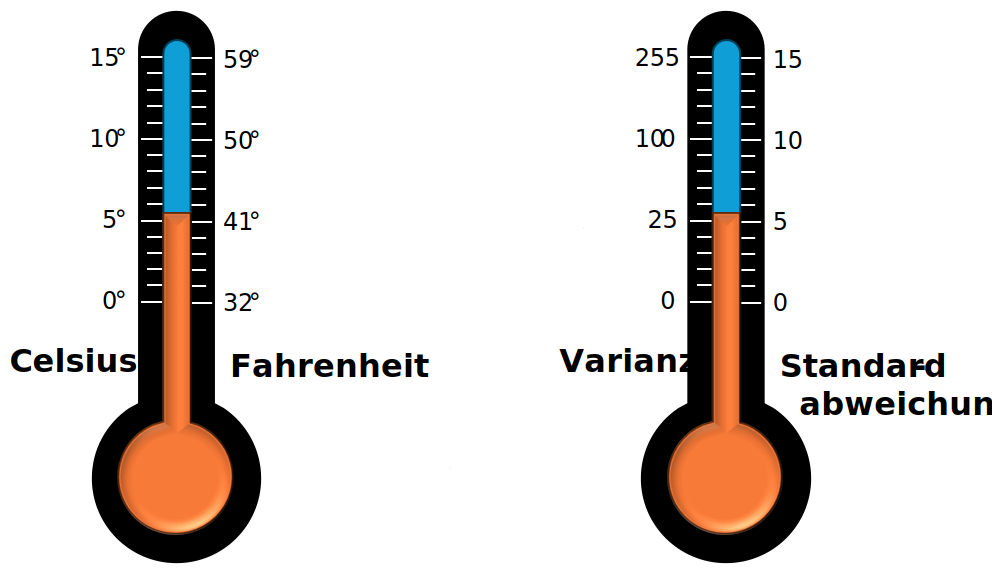

# Varianz und Standardabweichung

Die Varianz und Standardabweichungen sind die wichtigsten Streumaße in der Statistik.

Je höher die Varianz bzw. die Standardabweichung ist, desto stärker sind die Datenpunkte verstreut.

Die Varianz und Standardabweichung hängen extrem eng zusammen. 
So eng, dass man sie nicht als zwei verschiedene Kennzahlen sehen sollte, sondern als die Selbe,
die bloß verschieden dargestellt wird. Dies ist ähnlich wie mit der Messung von Temperaturen: 
Wenn es 100 °C (Celsius) ist, ist es auch 212 °F (Fahrenheit). Beide beschreiben das gleiche,
jedoch etwas anders skaliert. So ist es auch mit der Varianz und der Standardabweichung.
Wir werden sehen, dass man mit der Varianz oft einfacher rechnen kann, die Standardabweichung
jedoch leichter von Menschen interpretierbar ist.

## Motivation für die Varianz

Die Varianz soll messen, wie sehr die Datenpunkte vom Mittelwert abweichen.

Der naive erste Ansatz wäre, die Abstände zum Mittelwert einfach zu berechnen, aber das ist leider sehr 
fruchtlos, da die Summe dieser Abstände immer $0$ ergibt! Das ist nicht gerade aussagekräftig, wenn für jede
Datenmenge immer dieselbe Kennzahl herauskommt.

Es hat sich daher als nützlich herausgestellt, nicht direkt die Abweichungen von Mittelwert zu messen,
sondern **das Quadrat der Abweichungen vom Mittelwert** zu messen und davon den **Durchschnitt** zu bestimmen.

In dieser Visualisierung ist das besonders gut ersichtlich:

[Link zur Visualisierung](https://www.geogebra.org/m/ahax9v8d){ .md-button target="_blank" }

{ target="_blank" }

## Formel

Die mathematische Formel für die Varianz sieht etwas Gruselig aus.

Die Varianz bezeichnet man oft als $\sigma^2$ und berechnet man wie folgt:

!!! formel "Formel für die Varianz mit Summenzeichen"

    $$
    \sigma^2 = \frac{1}{n} \left( \sum_{i=1}^n (x_i - \bar{x})^2 \right)
    $$

!!! formel "Formel für die Varianz ohne Summenzeichen"

    $$
    \sigma^2 = \frac{1}{n} \left( (x_1 - \bar{x})^2 + (x_2 - \bar{x})^2 + \cdots + (x_n - \bar{x})^2 \right)
    $$

!!! formel "Formel für die Standardabweichung"
    
    Die Standardabweichung wird oft mit $\sigma$ bezeichnet und wird bestimmt, indem man von der Varianz die Wurzel zieht:

    $$
    \sigma = \sqrt{\sigma^2}
    $$

!!! beispiel

    Gegeben Sie der folgende Datensatz, von dem wir die Varianz und Standardabweichung berechnen wollen:
    
    | normaler Index | Kuchenverkäufe |
    |----------------|----------------|
    | $x_1$          | $4$            |
    | $x_2$          | $6$            |
    | $x_3$          | $2$            |
    | $x_4$          | $3$            |
    | $x_5$          | $10$           |
    
    Um die Varianz zu berechnen, müssen wir zunächst das Arithmetische Mittel $\bar{x}$ bestimmen.
    Hier also
    
    $$
    \bar{x} = \frac{1}{5} \left( 4 + 6 + 2 + 3 + 10 \right) = \frac{1}{5} \cdot 25 = 5
    $$
    
    Dann wird von jedem Datenpunkt berechnet, welchen Abstand er zum Mittelwert hat:
    
    | normaler Index | Kuchenverkäufe | $x_i - \bar{x}$ |
    |----------------|----------------|-----------------|
    | $x_1$          | $4$            | $5-4=-1$        |
    | $x_2$          | $6$            | $5-6=1$         |
    | $x_3$          | $2$            | $5-2=-3$        |
    | $x_4$          | $3$            | $5-3=-2$        |
    | $x_5$          | $10$           | $5-10=5$        |
    
    Die Summe der Abweichungen ist immer $0$ und daher absolut nichtssagend.
    
    Um starke Abweichungen stärker zu betonen und schwache Abweichungen weniger zu betonen,
    werden die Quadrate dieser Abweichungen gebildet.
    
    | normaler Index | Kuchenverkäufe | $x_i - \bar{x}$ | $(x_i - \bar{x})^2$ |
    |----------------|----------------|--------------|---------------------|
    | $x_1$          | $4$            | $-1$         | $(-1)^2=1$          |
    | $x_2$          | $6$            | $1$          | $1^2=1$             |
    | $x_3$          | $2$            | $-3$         | $(-3)^2=9$          |
    | $x_4$          | $3$            | $-2$         | $(-2)^2=4$          |
    | $x_5$          | $10$           | $5$          | $5^2=25$            |
    
    Von diesen Abweichungsquadraten berechnen wir nun den Durschnitt. Das Ergebnis dieser Rechnung
    ist nun endlich die **Varianz** $\sigma^2$!
    
    $$
    \begin{align}
    \sigma^2 &= \frac{1}{n} \left( \sum_{i=1}^n (x_i - \bar{x})^2 \right) \\
    &= \frac{1}{5} \left( (x_1 - \bar{x})^2 + (x_2 - \bar{x})^2 + (x_3 - \bar{x})^2 + (x_4 - \bar{x})^2 + (x_5 - \bar{x})^2 \right) \\
    &= \frac{1}{5} \left( 1 + 1 + 9 + 4 + 25 \right) \\
    &= \frac{1}{5} \cdot 40 \\
    &= 8
    \end{align}
    $$
    
    Abschließend können wir nun noch die Standardabweichung $\sigma$ bestimmen, indem wir von
    der Varianz die Wurzel ziehen:
    
    $$
    \sigma = \sqrt{\sigma^2} = \sqrt{8} \approx 2{,}8284\dots
    $$
    
    **Zusammengefasst**: Bei dem Datensatz $(4, 6, 2, 3, 10)$ ist das Arithmetische Mittel $\bar{x} = 5$, die Varianz $\sigma^2=8$ und die Standardabweichung $\sigma\approx 2{,}8284$.

{{ task(file="tasks/deskriptive_statistik/varianz_vorhersagen.yaml") }}

{{ task(file="tasks/deskriptive_statistik/varianz_bestimmen.yaml") }} 

!!! excel

    Die Varianz kann in Excel mit Hilfe der Formel [`VAR.P`](https://support.microsoft.com/de-de/office/var-p-funktion-73d1285c-108c-4843-ba5d-a51f90656f3a)
    berechnet werden.

    Die Standardabweichung kann in Excel mit Hilfe der Formel [`STABW.N`](https://support.microsoft.com/de-de/office/stabw-n-funktion-6e917c05-31a0-496f-ade7-4f4e7462f285)
    berechnet werden.

    <iframe width="100%" height="400" frameborder="0" scrolling="no" src="https://qualidyschulungen-my.sharepoint.com/personal/viktor_reichert_qualidy_de/_layouts/15/Doc.aspx?sourcedoc={3e0e208d-9ba0-45ee-8355-fc03cb898635}&action=embedview&AllowTyping=True&ActiveCell='VAR.P%20und%20STABW.N'!C2&wdDownloadButton=True&wdInConfigurator=True&wdInConfigurator=True"></iframe>

## Varianz und Standardabweichung interpretieren

Oft fällt es Einsteigern die Varianz beziehungsweise Standardabweichung zu interpretieren. Und dies gestaltet sich auch 
tatsächlich als schwierig. Es gilt immer:

* Je größer die Varianz/Standardabweichung ist, desto größer sind die Schwankungen in den Daten.

Wenn die Daten normal verteilt sind (was genau das bedeutet, werden wir später untersuchen,
doch für den Moment können Sie glauben, dass sehr viele Datensätze normal verteilt sind), so können
wir mithilfe der einer einfachen Formel abschätzen, wie die Daten um das arithmetische Mittel
verteilt sind. Das geht wie folgt:

Wenn der Datensatz normalverteilt sind und wir kennen das Arithmetische Mittel $\bar{x}$ und 
die Standardabweichung $\sigma$, so befinden sich 

## Variazionskoeffizient

Um die Varianz besser zu interpretieren, wird manchmal der Variationskoeffizient verwendet. 
Dieser übersetzt die Streuung in einen prozentualen Wert.

!!! formel

    Der **Variationskoeffizient** $v$ wird berechnet, indem man die Standardabweichung durch den Mittelwert teilt:
    
    $$
    v = \frac{\sigma}{\bar{x}}  
    $$

!!! beispiel

    Ein Wertpapier, dessen Wert durchschnittlich bei 20 EUR liegt und zwischen 10 und 30 EUR schwankt, 
    weist ein höheres Risiko auf als ein Wertpapier mit einem mittleren Wert von 200 EUR, das zwischen 190 und 210 EUR variiert.
    
    Man beachte, dass die Datensätze $X = (10, 20, 30)$ und $Y = (190, 200, 210)$ 
    dieselbe Varianz ($\sigma_X^2 = \sigma_Y^2 \approx 66{,}67 \, \text{EUR}^2$), 
    und Standardabweichung ($\sigma_X = \sigma_Y \approx 8{,}16 \, \text{EUR}$).

    Der Variationskoeffizient zeigt jedoch, dass die Schwankungen im ersten Fall etwa 41 % des Durchschnittswertes ausmachen, während sie im zweiten Fall nur 4 % betragen:

    $$
    v_X \approx \frac{8{,}16}{20} \approx 0{,}41; \quad v_Y \approx \frac{8{,}16}{200} \approx 0{,}04
    $$

!!! excel

    In Excel gibt es keine eigene Formel zum Berechnung des Variationskoeffizienten. Stattdessen
    wird die Rechnung für einen gewünschten `Bereich` selbst ausgeführt: `=STABW.P(Bereich)/MITTELWERT(Bereich)`.

    <iframe width="100%" height="400" frameborder="0" scrolling="no" src="https://qualidyschulungen-my.sharepoint.com/personal/viktor_reichert_qualidy_de/_layouts/15/Doc.aspx?sourcedoc={1d74e621-d579-4d15-8209-e4bca0b29478}&action=embedview&AllowTyping=True&ActiveCell='Variationskoeffizient'!C5&wdDownloadButton=True&wdInConfigurator=True&wdInConfigurator=True"></iframe>
