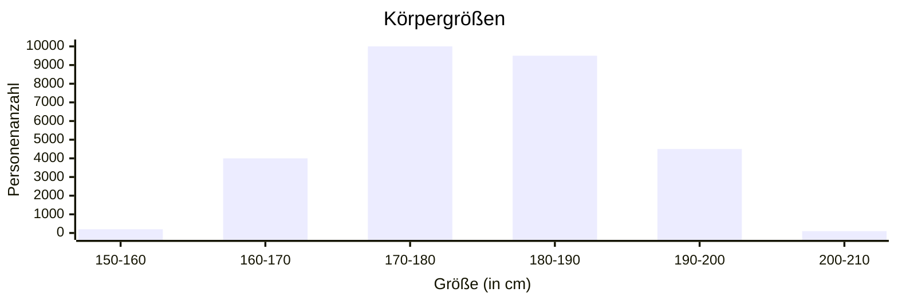
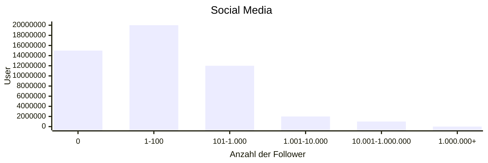
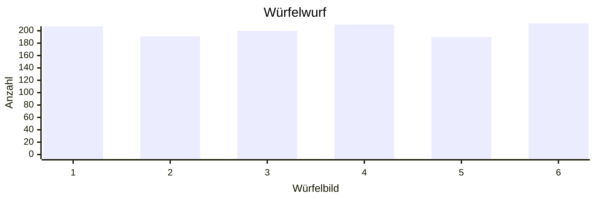
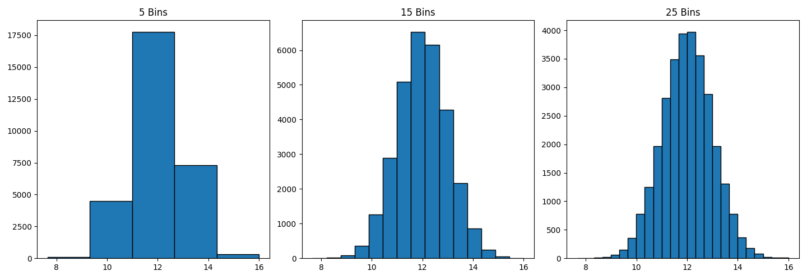

# Verteilungen

_Wie oft kommen gegebene Werte vor?_

Eine Verteilung beschreibt, wie sich Daten oder Werte über einen bestimmten Bereich verteilen. Sie zeigt dir, wie häufig bestimmte Werte in einem Datensatz vorkommen und gibt dir eine Übersicht darüber, wie die Daten insgesamt aussehen.

Stell dir vor, du misst die Körpergrößen einer Gruppe von Menschen. Einige Personen sind klein, viele haben eine mittlere Größe und ein paar sind sehr groß. Die Verteilung dieser Größen zeigt, wie viele Menschen jeweils klein, mittelgroß oder groß sind.

Es gibt verschiedene Formen von Verteilungen:

_Normalverteilung:_   
Eine häufig vorkommende Verteilung, die aussieht wie eine Glocke. Die meisten Daten liegen in der Mitte (zum Beispiel viele Menschen haben eine durchschnittliche Körpergröße), und nach beiden Seiten hin (klein und groß) werden es immer weniger.  
 

_Schiefe Verteilung:_   
Wenn die Verteilung nicht symmetrisch ist, sondern mehr Werte auf einer Seite konzentriert sind, sagt man, die Verteilung ist "schief". Wenn z. B. die meisten Menschen kleiner als der Durchschnitt sind, ist die Verteilung nach rechts „schief“.  

_Gleichverteilung:_   
Bei dieser Verteilung kommen alle Werte ungefähr gleich häufig vor, z. B. wenn jeder Würfelwert (1 bis 6) bei vielen Würfen ungefähr gleich oft auftaucht.  

Eine Verteilung hilft dir also zu verstehen, ob deine Daten eine bestimmte Form oder Muster haben, wie oft welche Werte vorkommen und wie unterschiedlich die Daten sind.  

Diese Verteilungen lassen sich über Histogramme oder auch Dichtefunktionen, gut auf einen Blick erfassen.

_Was ist ein Histogramm?_

Ein Histogramm ist eine Grafik, die zeigt, wie oft bestimmte Werte in einem Datensatz vorkommen.

Kurz gesagt:  

Die x-Achse zeigt die Werte (z. B. Körpergröße).  
Die y-Achse zeigt die Häufigkeit, also wie oft diese Werte vorkommen.

_Beispiel_

In diesem Beispiel sind normalverteilte Daten in mehreren Histogrammen dargestellt.

Diese Daten können jeden beliebigen Kommawert annehmen. Um sie in einem Histogramm darzustellen, müssen die Daten in Gruppen zusammengefasst werden. Im Ersten Histogramm wurden 5 Gruppen gebildet. Der mittlere Balken beinhaltet also alle Werte, die in die Gruppe 11-12,5 fallen. Das wären in diesem Fall 17.500 Datenpunkte. Man kann diese Gruppen aber auch schmaler machen, um ein schärferes Bild zu bekommen. Je schmaler die Balken werden, desto mehr nähert man sich der Dichtefunktion der Normalverteilung an.

Die Balken sind sehr anschaulich, haben aber den Nachteil, dass man bei der Beurteilung der Daten an die gegebene Gruppierung gebunden ist. Die Dichtefunktion der Normalverteilung ist schwieriger zu lesen, bietet aber die Möglichkeit, jede beliebige Gruppierung zu berechnen.  

## Normalverteilung

Die Normalverteilung ist eine der wichtigsten Verteilungen in der Statistik. Sie wird auch oft als Glockenkurve bezeichnet, weil sie die Form einer Glocke hat.

Bei einer Normalverteilung sind die Daten symmetrisch um den Mittelwert verteilt. Das bedeutet, dass die meisten Werte nah am Mittelwert liegen und es immer weniger Werte gibt, je weiter man sich davon entfernt. Beispiele wären Körpergrößen oder Intelligenztests, die oft ungefähr normalverteilt sind.

Eigenschaften der Normalverteilung:

- Der Mittelwert, Median und Modus sind gleich.  
- Sie ist symmetrisch, d.h. links und rechts vom Mittelwert sieht die Verteilung gleich aus.  
- 68% der Werte liegen innerhalb einer Standardabweichung vom Mittelwert, 95% innerhalb von zwei.  
  
Die Normalverteilung hilft, viele natürliche Phänomene zu modellieren und Wahrscheinlichkeiten zu berechnen.

$$ f(x) = \frac{1}{\sigma \sqrt{2\pi}} e^{-\frac{1}{2}(\frac{x-\mu}{\sigma})^2} $$

Diese Funktion muss man sich an dieser Stelle nicht unbedingt merken. Wichtig ist, dass sie nur von zwei Parametern abhängt. Das sind zum Einen die Standardabweichung $\sigma$ und zum Anderen der Mittelwert $\mu$.  

Auf dem Bild erkennt man schon die 68-95-99,7-Regel. Diese besagt, dass 68% der Datenpunkte einen Abstand von maximal einer Standardabweichung zum Mittelwert haben, 95% der Datenpunkte einen Abstand von maximal zwei Standardabweichungen und 99,7% einen Abstand von maximal drei Standardabweichungen haben.  

_Beispiel_

Angenommen die Normalverteilung beschreibe die Körpergrößen aller Menschen, der Mittelwert sei 173cm und die Standardabweichung 5cm.  

Was können wir dann für Aussagen über die Bevölkerung machen?  

Ein Abstand von maximal einer Standardabweichung ist der Bereich 168cm-178cm. Dank der Normalverteilung können wir also daraus schließen, dass 68% der Menschen in diesem Bereich liegen. Umgekehrt heißt das, dass 32% nicht in diesem Bereich sind. Da die Normalverteilung symmetrisch ist, sind also 16% kleiner als 168cm und 16% größer als 178cm.  
Die gleichen Überlegungen kann man sich dementsprechend bei einem Abstand von zwei Standardabweichungen bzw. drei Standardabweichungen machen:

_Aufgabe_  
Was sind die Grenzen des Bereichs in dem 95% der Menschen liegt? Wie viele sind größe, wie viele kleiner?  
Was sind die Grenzen des Bereichs in dem 99,7% der Menschen liegt? Wie viele sind größe, wie viele kleiner?  

## Z-Werte

Z-Werte (auch z-Scores genannt) geben an, wie weit ein Wert von einem Durchschnitt (Mittelwert) entfernt ist, gemessen in Standardabweichungen. Sie helfen dabei, Daten in Bezug auf den Durchschnitt zu vergleichen, selbst wenn die Einheiten unterschiedlich sind.  

Ein Z-Wert von 0 bedeutet, der Wert liegt genau beim Mittelwert.  
Ein positiver Z-Wert bedeutet, der Wert liegt über dem Mittelwert.  
Ein negativer Z-Wert bedeutet, der Wert liegt unter dem Mittelwert.  

Kurz gesagt: Z-Werte machen es leicht, zu verstehen, wie ungewöhnlich oder normal ein Wert im Vergleich zum Durchschnitt ist.  

$$ z = \frac{x-\mu}{\sigma} $$

Mithilfe des z-Wertes kann man bestimmen, wie viel Prozent der Grundgesamtheit einer Normalverteilung unterhalb des Datenpunktes x liegt.

_Beispiel_  

Geht man wieder von einem Mittelwert von 173cm und einer Standardabweichung von 5cm aus, dann lässt sich der z-Wert zum Datenpunkt 180cm folgendermaßen berechnen:

$$ z = \frac{180-173}{5} = \frac{7}{5} = 1,4 $$

Umgekeht kann man auch vom z-Wert zurück auf den Datenpunkt x schließen.

$$ z \cdot \sigma = x-\mu $$

$$ 1,4 \cdot \sigma = 1,4 \cdot 5 = 7 $$

Der Datenpunkt x mit dem z-Wert 1,4 hat also einen Abstand von 7 zum Mittelwert oder anders gesagt: der Datenpunkt x ist 1,4 Standardabweichungen vom Mittelwert entfernt.  

Mithilfe dieses z-Wertes und der dazugehörigen Tabelle, können wir nun bestimmen wie viel Prozent der Menschen kleiner als 180cm sind. 

Für unseren z-Wert lässt sich also 0,9192 ablesen, was ungefähr 92% entspricht. Damit wissen wir nun, dass 92% kleiner als 180cm sind.

Umgekehrt können wir uns auch fragen, wie groß man sein muss, um in den obersten 10% zu liegen. Dafür suchen wir der Tabelle nach dem Wert 0,9. Am nähesten kommt der z-Wert 1,28 mit 0,8997. Das reicht aber nicht ganz aus, um in den obersten 10% zu sein. Daher müssen wir uns für den z-Wert 1,29 entscheiden, auch wenn der etwas weiter von 0,9 entfernt ist. Bei einem z-Wert von 1,29 ist man also größer als 90,15% der Bevölkerung.

$$ x-\mu = z \cdot \sigma = 1,29 \cdot 5 = 6,45 $$

$$ x = 6,45 + \mu = 6,45 + 173 = 179,45 $$

Man muss also größer als 179,45cm sein, um in den obersten 10% zu liegen.

Zusammengefasst lautet die Formel:

$$ x = z \cdot \sigma + \mu $$

Hat man es aber mit negativen z-Werten zu tun, dann kann mach sich die Symmetrie der Normalverteilung zu Nutze machen.

_Beispiel_

Bei einem z-Wert von -0,5, sucht man einfach in der Tabelle nach dem Wert 0,5 und berechnet zu dem entsprechenden Prozentwert die Gegenwahrscheinlichkeit.

Zu dem z-Wert von 0,5 findet mach in der Tabelle den Wert 0,6915. Die Gegenwahrscheinlichkeit ist dann der Wert, mit dem zu 100% bzw. 1 aufgefüllt wird. Mit anderen Worten: $Gegenwahrscheinlichkeit = 100\% - Wahrscheinlichkeit$.

$$ 1 - 0,6915 = 0,3085 $$

Bei einem z-Wert von -0,5 (entspricht $x = -0,5 \cdot 5 + 173 = 170,5$) ist man größer als ungefähr 31% der Bevölkerung.

_Aufgabe: z-Werte_

Annahme: Körpergröße ist normalverteilt, der Mittelwert ist 173cm und die Standardabweichung ist 5cm.  
Wie groß muss man mindestens sein, um zu den größten 60% der Bevölkerung zu gehören?

