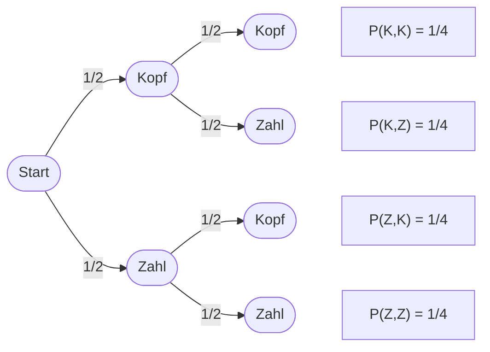

# Wahrscheinlichkeitstheorie

Die Wahrscheinlichkeitstheorie ist der Bereich der Mathematik, der sich damit beschäftigt, wie wahrscheinlich es ist, dass ein bestimmtes Ereignis eintritt. Sie hilft uns, Unsicherheiten und Zufälle zu verstehen und zu quantifizieren.  

In der Wahrscheinlichkeitstheorie wird jedem möglichen Ereignis eine Zahl zwischen 0 und 1 zugewiesen:  

Eine Wahrscheinlichkeit von 0 bedeutet, dass das Ereignis niemals passiert.  
Eine Wahrscheinlichkeit von 1 bedeutet, dass das Ereignis immer passiert.  

Beispiel: Beim Werfen einer Münze hat man zwei mögliche Ergebnisse – Kopf oder Zahl. Da beide Ergebnisse gleich wahrscheinlich sind, beträgt die Wahrscheinlichkeit für Kopf 0,5 oder 50%.  

Die Wahrscheinlichkeitstheorie bildet die Grundlage für viele Konzepte in Statistik und Data Science, wie z. B. Vorhersagen, Risiken einschätzen und Entscheidungen unter Unsicherheit treffen.  

_mathematische Schreibweise_

$$ P(Ereignis) $$

zum Beispiel beim Münzwurf:

$$ P(Kopf)= 0,5 $$

Alle möglichen Ereignisse eines Versuchs müssen dabei in der Summe 100% bzw. 1 ergeben.

Oft sieht man auch so etwas wie $P(X \leq 3)$. Auf ein Würfelwurd bezogen, ist damit die Wahrscheinlichkeit gemeint, eine 3 oder etwas kleineres zu würfeln.

## Laplace-Experiment

Ein Laplace-Experiment ist ein Zufallsexperiment, bei dem alle möglichen Ergebnisse gleich wahrscheinlich sind. Es basiert auf der Idee des Mathematikers Pierre-Simon Laplace. Die Wahrscheinlichkeit, dass ein bestimmtes Ereignis eintritt, wird folgendermaßen berechnet:

$$ P(E) = \frac{Anzahl\ der\ günstigen\ Ergebnisse}{Anzahl\ aller\ möglichen\ Ergebnisse} $$

_Beispiel_  
Wenn du einen fairen Würfel wirfst, sind die sechs möglichen Ergebnisse (1, 2, 3, 4, 5, 6) gleich wahrscheinlich. Jede Zahl hat die gleiche Wahrscheinlichkeit von $\frac{1}{6}$.  
Die Wahrscheinlichkeit eine 3 oder etwas kleineres zu würfeln, lässt sich folgendermaßen berechnen. Es gibt in diesem Fall drei günstige Ergebnisse (1, 2, 3) von insgesamt sechs möglichen Ergebnisse (1, 2, 3, 4, 5, 6).

$$ P(X \leq 3) = \frac{3}{6} = \frac{1}{2} $$

Die Wahrscheinlichkeit dieses Ereignisses ist also $\frac{1}{2}$ bzw. 50%.

_Aufgabe: Laplace-Experiment_
Ein Kartenspiel enthält 52 Karten (ohne Joker). Du ziehst eine Karte.  

a) Wie groß ist die Wahrscheinlichkeit, ein Herz zu ziehen?  
b) Wie groß ist die Wahrscheinlichkeit, eine Ass-Karte zu ziehen?  

Ein Glücksrad ist in 8 gleich große Sektoren unterteilt, die mit den Zahlen 1 bis 8 beschriftet sind. Das Rad wird einmal gedreht.  

a) Wie groß ist die Wahrscheinlichkeit, dass eine ungerade Zahl kommt?  
b) Wie groß ist die Wahrscheinlichkeit, dass eine Zahl größer als 5 kommt?  

## Bernoulli-Experiment

Ein Bernoulli-Experiment ist ein Zufallsexperiment, das nur zwei mögliche Ergebnisse hat: Erfolg oder Misserfolg. Es ist benannt nach dem Mathematiker Jakob Bernoulli.  

Bei einem Bernoulli-Experiment wird nur die Erfolgswahrscheinlichkeit angegeben, da sich die Wahrscheinlichkeit für Misserfolg dadurch ergibt, dass beide zusammen 100% sein müssen.

$$ Erfolgswahrscheinlichkeit: p $$

$$ Misserfolgswahrscheinlichkeit: 1-p $$

_Beispiel_  
Stell dir vor, du wirfst eine Münze:

Kopf kann als Erfolg gelten, Zahl als Misserfolg.  

$$ P(Erfolg) = P(Kopf) = \frac{1}{2} $$

$$ P(Misserfolg) = P(Zahl) = 1 - \frac{1}{2} = \frac{1}{2} $$

Man kann auch den Würfelwurf als Bernoulli-Experiment betrachten. Möchte man zum Beispiel eine 6 Würfeln, dann wäre ein Misserfolg jede andere gewürfelte Zahl.

$$ P(Erfolg) = \frac{1}{6} $$

$$ P(Misserfolg) = 1 - \frac{1}{6} = \frac{5}{6} $$

Solche Experimente sind die Grundlage für viele wichtige Konzepte in der Statistik, wie zum Beispiel die Binomialverteilung, bei der es um die Anzahl von Erfolgen in mehreren Bernoulli-Experimenten geht.  

## Baumdiagramme

Ein Baumdiagramm ist eine grafische Darstellung, die hilft, Schritt-für-Schritt alle möglichen Ergebnisse eines mehrstufigen Zufallsexperiments zu zeigen. Es sieht aus wie ein Baum mit Ästen und hilft, die Wahrscheinlichkeiten für verschiedene Pfade oder Ereignisse zu berechnen.

_Aufbau:_  
Ein Baumdiagramm beginnt mit einem Startpunkt.  
Von diesem Startpunkt aus verzweigen sich Äste, die die möglichen Ereignisse der ersten Stufe zeigen.  
An jedem Punkt, an dem ein Ast endet, können neue Äste für die nächsten Stufen des Experiments entstehen.  
Jedem Ast und jedem Punkt können dabei Wahrscheinlichkeiten zugeordnet werden.  

_Beispiel_  
Folgendes Baumdiagramm modelliert einen zweifachen Münzwurf:

Im Verlauf der Schulung werden wir Baumdiagramme nutzen, um Sachverhalte zu veranschaulichen.

## Additionsregel

Die Additionsregel ist ein wichtiges Konzept in der Wahrscheinlichkeitstheorie, das uns hilft, die Wahrscheinlichkeit von mindestens einem von mehreren Ereignissen zu berechnen.  
Man kann damit die Wahrscheinlichkeit berechenen, ob Ereignis $A$ oder Ereignis $B$ eintritt.  

_Beispiel_  
Betrachten wir wieder den zweifachen Münzwurf, dann können wir uns fragen, wie hoch die Wahrscheinlichkeit ist, zweimal das gleiche Symbol zu erhalten. Dafür müssen wir jedes Ereignis, bei dem dieses Szenario erfüllt ist, addieren.

Wir wissen aus dem Laplace-Experiment, dass wir diese Wahrscheinlichkeit einfach über die Anzahlen berechenen können, da jedes Ergebnis gleich wahrscheinlich ist. In diesem Fall möchten wir aber die Additionsregel anwenden. Wir addieren in diesem Fall also die Wahrscheinlichkeit für zweimal Kopf zu bekommen mit der Wahrscheinlichkeit zweimal Zahl zu bekommen.

$$ P(zweimal\ gleiches\ Symbol) = P(Kopf, Kopf) + P(Zahl, Zahl) = \frac{1}{4} + \frac{1}{4} = \frac{1}{2} $$

Als Ergebnis erhalten wir also 50%. In diesem Fall war die Rechnung sehr einfach, weil die Ereignisse "Kopf, Kopf" und "Zahl, Zahl" komplett unabhängig voneinander sind.

In einem zweiten Beispiel möchten wir die Wahrscheinlichkeit berechnen, dass die Münze beim zweimaligen Werfen mindestens einmal Kopf zeigt.

Wenn wir uns das Baumdiagramm angucken, welches alle möglichen Fälle darstellt, sehen wir, dass in drei von vier Fällen mindesten einmal Kopf vorkommt. Mithilfe von Laplace können wir also die Wahrscheinlichkeit berechnen:

$$ P(mind.\ einmal\ Kopf) = \frac{3}{4} $$

Versuchen wir nun das gleiche mit der Additionsregel, dann fällt folgendes auf. Die Wahrscheinlichkeit, dass beim ersten Wurf Kopf fällt, ist genau wie beim zweiten Wurf 50%. $W_1$ soll hier den ersten Wurf beschreiben, $W_2$ den zweiten.

$$ P(mind.\ einmal\ Kopf) \overset{?}{=} P(W_1:Kopf) + P(W_2:Kopf) = \frac{1}{2} + \frac{1}{2} = 1 $$

Diese Rechnung sagt uns also, dass die Wahrscheinlichkeit 100% betragen würden. Das kann natürlich nicht sein, weil wir wissen, dass Zahl, Zahl auch eine Möglichkeit ist.  
Das Problem hier ist, dass wir ein Ereignis doppelt zählen. Die 50% vom zweiten Wurf setzen sich nämlich aus den Ereignissen "Kopf, Kopf" und "Zahl, Kopf" zusammen. Dass beim ersten Wurf Kopf fällt, ist hier also ebenfalls teilweise vertreten. Hier überlappen sich also die Wahrscheinlichkeiten $P(W_1:Kopf)$ und $P(W_2:Kopf)$. Um diese Überlappung nicht doppelt zu zählen, müssen wir sie in unserer Formel berücksichtigen.

_mathematische Schreibweise:_

$$ P(A \cup B) = P(A) + P(B) - P(A \cap B) $$ 

Die korrekte Berechnung subtrahiert also die Überlappung von $A$ und $B$, welche sowohl in $P(A)$ **und** in $P(B)$ vertreten ist, damit sie am Ende nur einfach mitgezählt wird.

$$ P(mind.\ einmal\ Kopf) = P(W_1:Kopf) + P(W_2:Kopf) - P(Kopf,Kopf) $$

$$ = \frac{1}{2} + \frac{1}{2} - \frac{1}{4} = \frac{3}{4} $$

Mit dieser Formel gelangen wir zur korrekten Lösung.

## Multiplikationsregel

Die Multiplikationsregel ist ein Konzept in der Wahrscheinlichkeitstheorie, das hilft, die Wahrscheinlichkeit von zwei oder mehr Ereignissen zu berechnen, wenn sie "nacheinander" auftreten. 
Man kann damit die Wahrscheinlichkeit berechenen, ob Ereignis $A$ und Ereignis $B$ eintritt.

Hierbei müssen wir unterscheiden, ob die Ereignis **abhängig** oder **unabhängig** von einander sind.

_Beispiel_  
_Stellt man sich vor, man würde mit einem Würfel zweimal würfeln. Die Wahrscheinlichkeit, ob beim ersten Wurf eine "6" gewürfelt wird, ist genauso so groß wie die Wahrscheinlichkeit, dass beim zweiten Wurf eine "6" gewürfelt wird. Diese beiden Wahrscheinlichkeiten sind **unabhängig**._  
_Vergleichen wir das mit dem Ziehen einer Karte aus einem Deck ohne Zurücklegen. Im ersten Zug ist die Wahrscheinlichkeit ein Ass zu ziehen $\frac{4}{52}$. Wenn ich meine gezogene Karte nicht zurücklege, dann habe ich im zweiten Zug nur noch 51 Karten übrig. Will ich dann ein weiteres Ass ziehen, dann weiß ich, dass auch nur noch 3 Asse im Deck vorhanden sind. Die Wahrscheinlichkeit im zweiten Zug noch ein Ass zu ziehen ist in diesem Fall dann also $\frac{3}{51}$. Genauso verändert sich auch die Wahrscheinlichkeit irgendeine andere Karte zu ziehen, da das gesamte Deck kleiner geworden ist. In diesem Fall haben wir es also mit **abhängigen** Ereignissen zu tun._

### unabhängige Ereignisse

$$ P(A \cap B) = P(A) \cdot P(B) $$

- $P(A \cap B)$ ist die Wahrscheinlichkeit, dass beide Ereignisse $A$ und $B$ eintreten
- $P(A)$ ist die Wahrscheinlichkeit für das Ereignis $A$
- $P(B)$ ist die Wahrscheinlichkeit für das Ereignis $B$

_Beispiel_  
_Möchte man zweimal hintereinander eine "6" würfeln, dann geschieht das statistisch gesehen beim ersten Wurf in einem von sechs Fällen und bei zweiten Wurf ebenfalls. Würden wir das Experiment "zweimal würfeln" 36-mal durchführen, dann wäre statistisch gesehen jeder 6. Wurf eine "6". Von den 36 Experiment würden also 6 Experimente beim ersten Wurf eine "6" würfeln. Beim zweiten Mal würfeln, würden von 6 übrig gebliebene Experimente ebenfalls nur jedes 6. eine "6" würfeln. Es bleibt von den 36 Experimenten vom Start also nur ein Experiment übrig, bei dem zweimal hintereinander eine "6" gewürfelt wurde._

$$ P(6,6) = \frac{1}{6} \cdot \frac{1}{6} = \frac{1}{36} $$

_Die Wahrscheinlichkeit, zweimal hintereinander eine "6" zu würfeln, ist also $\frac{1}{36}$._

### abhängige Ereignisse

$$ P(A \cap B) = P(A) \cdot P(B|A) $$

- $P(A \cap B)$ ist die Wahrscheinlichkeit, dass beide Ereignisse $A$ und $B$ eintreten
- $P(A)$ ist die Wahrscheinlichkeit für das Ereignis $A$
- $P(B|A)$ ist die Wahrscheinlichkeit, dass das Ereignise $B$ eintritt, **wenn** vorher das Ereignis $A$ eingetreten ist

_Beispiel_  
_Gegeben sei eine Urne mit 3 blauen und 5 roten Kugeln. Es sollen 3 rote Kugeln hintereinander gezogen werden. Für den ersten Zug ist die Wahrscheinlichkeit rot zu ziehen $\frac{5}{8}$, da von ingesamt 8 Kugeln 5 rot sind. Will man jetzt wieder eine rote Kugel ziehen, dann ist die Wahrscheinlichkeit nicht mehr $\frac{5}{8}$, weil zu diesem Zeitpunkt nur noch 7 Kugeln in der Urne sind, von denen 4 rot sind. Die Wahrscheinlichkeit rot zu ziehen, verändert sich also, weil die beiden Ereignisse abhängig sind. Beim zweiten Zug ist die Wahrscheinlichkeit entsprechend $\frac{4}{7}$. Beim dritten Zug verändert sie sich zu $\frac{3}{6}$._

$$ \frac{5}{8} \cdot \frac{4}{7} \cdot \frac{3}{6} = \frac{5}{28} $$

_In 5 von 28 Fällen zieht man also drei rote Kugeln hintereinander. Oder anders gesagt: mit einer Wahrscheinlichkeit von ungefähr 18% zieht man beim ersten Versuch drei rote Kugeln hintereinander._

_Beispiel: Kartendeck_
_Als Nächstes möchten wir uns überlegen, was die Wahrscheinlichkeit ist, aus einem Kartendeck erste ein Ass und dann eine Herz-Karte zu ziehen. Die Wahrscheinlichkeit erst ein Ass zu ziehen, ist natürlich $\frac{4}{52}$. Was ist dann aber die Wahrscheinlichkeit, eine Herz-Karte danach zu ziehen? Um diese Wahrscheinlichkeit zu bestimmen, muss man wissen wie viele Herz-Karten noch in den verbliebenen 51 Karten vorhanden sind. Das kommt darauf an, ob das Ass aus dem 1. Zug selbst eine Herz-Karte war oder nicht. Unsere Rechnung spaltet sich also in zwei Teile._

_Das erste Ereignis ist, dass wir im ersten Zug nicht das Herz-Ass ziehen. Da es 3 Asse gibt, die kein Herz sind, ist die Wahrscheinlichkeit $\frac{3}{52}$. Ist das der Fall, dann befinden sich danach noch 13 Herz-Karten im Deck. Die Wahrscheinlichkeit, eine davon zu ziehen, ist dann $\frac{13}{51}$._  
_Das zweite Ereignis beschreibt den Fall, dass im ersten Zug Herz-Ass gezogen wird ($\frac{1}{52}$). Dann befinden sich noch 12 Herz-Karten im Deck ($\frac{12}{51}$)._  
_Diese beiden Ereignisse müssen nur noch addiert werden (Additionsregel), um auf die Antwort des Problems zu kommen._

$$ P(Ass, Herz) = \frac{3}{52} \cdot \frac{13}{51} + \frac{1}{52} \cdot \frac{12}{51} = \frac{1}{52} $$

_Die Wahrscheinlichkeit, erst ein Ass und dann eine Herz-Karte zu ziehen, beträgt ungefähr 2%_

## Satz von Bayes

Der Satz von Bayes ist ein grundlegendes Konzept in der Wahrscheinlichkeitstheorie, das hilft, die bedingte Wahrscheinlichkeit zu berechnen. Er zeigt, wie wir die Wahrscheinlichkeit eines Ereignisses $A$ berechnen können, wenn wir bereits wissen, dass ein anderes Ereignis $B$ eingetreten ist.

$$ P(A|B) = \frac{P(B|A) \cdot P(A)}{P(B)} $$

Die Herleitung dafür ist recht einfach: wir wissen, wie die Wahrscheinlichkeit, dass $A$ und $B$ eintreten, mit bedingten Wahrscheinlichkeiten berechnen können.

$$ P(A \cap B) = P(A) \cdot P(B|A) $$

Das wäre die Rechnung, wenn zuerst A und dann B eintritt. Umgekehrt siehts ähnlich aus.  

$$ P(B \cap A) = P(B) \cdot P(A|B) $$

Wenn $A$ und $B$ eintreten, spielt es aber keine Rolle, in welcher Reihenfolge das geschieht.

$$ P(A \cap B) = P(B \cap A) $$

Oder wenn wir die anderen Seiten der Gleichungen betrachten:

$$ P(A) \cdot P(B|A) = P(B) \cdot P(A|B) $$

Durch einfaches Umstellen gelangen wir dann zum Satz von Bayes.

$$ P(A|B) = \frac{P(B|A) \cdot P(A)}{P(B)} $$

Der Satz von Bayes ist hilfreich, weil in vielen Fällen eine der beiden bedingten Wahrscheinlichkeiten leicht zu bestimmen ist, während die andere schwierig zu bestimmen ist. Mit dem Satz von Bayes kann man dann die jeweils andere bedingte Wahrscheinlichkeit berechnen.

_Beispiel_  
_Wir stellen uns einen zweifachen Münzwurf vor. Das Ereignis $A$ soll beschreiben, dass mindestens einmal Kopf fällt. Das Ereignis $B$ beschreibt, dass zweimal Kopf fällt._  
_Bei diesem Versuch gibt es 4 mögliche Ergebnisse (KK, KZ, ZK, ZZ). In 3 Fällen ist mindestens einmal Kopf gefallen. In einem Fall erhalten wir zweimal Kopf. Wenn wir nun die bedingte Wahrscheinlichkeit, dass zweimal Kopf kommt, wenn einmal Kopf gefallen ist, berechnen wollen, dann wissen wir: Es gibt 3 gleich wahrscheinliche Fälle, bei denen einmal Kopf vorkommt, und bei einem davon fällt zweimal Kopf. Die bedingte Wahrscheinlichkeit ist also $P(B|A) = \frac{1}{3}$._

_Möchte man das gleiche nun mithilfe des Satzes von Bayes berechnen, geht man folgendermaßen vor: die Wahrscheinlichkeit, dass mindestens einmal Kopf fällt, ist $P(A) = \frac{3}{4}$. Die Wahrscheinlichkeit, dass zweimal Kopf fällt, ist $P(B) = \frac{1}{4}$. Die bedingte Wahrscheinlichkeit, dass mindestens einmal Kopf fällt, wenn zweimal Kopf gefallen ist, ist natürlich $P(A|B) = 1$._

$$ P(B|A) = \frac{1 \cdot \frac{1}{4}}{\frac{3}{4}} = \frac{1}{3} $$

_Aufgabe: Satz von Bayes_  
Wähle aus zwei Behätlern einen zufällig aus. In Behälter 1 sind zwei rote und zwei blaue Kugeln, in Behälter 2 sind zwei rote und 4 blaue Kugeln. Was ist die Wahrscheinlichkeit, dass wir den ersten Behälter gewählt haben, wenn wir eine rote Kugel ziehen?  

## Erwartungswert
Der Erwartungswert ist ein zentrales Konzept in der Statistik und beschreibt den durchschnittlichen Wert, den man erwarten würde, wenn ein Zufallsexperiment viele Male durchgeführt wird. Er gibt also an, wo der "Schwerpunkt" einer Wahrscheinlichkeitsverteilung liegt.  

### Erwartungswert für diskrete Zufallsvariablen 

$$ E(X) = \sum_{i=1}^n (x_i \cdot P(x_i)) $$

_Beispiel_  
_Was ist der Erwartungswert eines Würfels?_  

$$ E(X) = 1 \cdot \frac{1}{6} + 2 \cdot \frac{1}{6} + 3 \cdot \frac{1}{6} + 4 \cdot \frac{1}{6} + 5 \cdot \frac{1}{6} + 6 \cdot \frac{1}{6} = 3,5 $$

_Wenn man einen Würfel oft wirft, dann wird der durchschnittliche Wert 3,5 ergeben._

_Beispiel_  
_Eine Firma macht bei einem TV-Modell einen Gewinn von 100€. In 2% der Verkäufe wird das Gerät allerdings zurückgeschickt, weil es defekt ist. In diesem Fall macht die Firma 800€ Verlust. Was ist der Erwartungswert des Gewinns?_  

$$ E(X) = 0,98 \cdot 100 + 0,02 \cdot (-800) = 82 $$

_Die Firma kann also mit einem durchschnittlichen Gewinn von 82€ pro Gerät rechnen._

## Gesetz der großen Zahlen

Das Gesetz der großen Zahlen ist ein grundlegendes Prinzip in der Statistik, das besagt, dass sich der Durchschnitt der Ergebnisse eines Zufallsexperiments bei sehr vielen Wiederholungen dem wahren Erwartungswert annähert.  

_Beispiel_  
_Stell dir vor, du wirfst eine faire Münze. Wenn du die Münze nur ein paar Mal wirfst, könnten die Ergebnisse stark schwanken (z. B. 3-mal Kopf und 1-mal Zahl). Aber wenn du die Münze sehr oft wirfst (z. B. 10.000 Mal), wird der Anteil der Kopf-Würfe immer näher an 50% herankommen._

Das Prinzip ist auch unter dem Spielertrugschluss (engl. "Gambler's Fallacy") bekannt. Ein Spieler in einem Casino, der den ganzen Abend eine Pechsträhne hat, mag vielleicht denken, dass seine Glückssträhne jeden Moment anfangen müsste. Das ist allerdings ein Trugschluss. Wenn man als Beispiel eine Münze nimmt, dann hat die Münze keine "Erinnerung", welche Ergebnisse in der Vergangenheit gefallen sind. Auch wenn bereits 10-Mal hintereinander Kopf kam, kann wieder 10-Mal hintereinander Kopf kommen. Statistisch gesehen wird sich langfristig zwar langfristig ein 50-50-Verhältnis ergeben. Ob das aber nach 10 Würfen oder 1.000.000 Würfen passiert, darüber macht das Gesetz der großen Zahlen keine Aussage. Die Geschwindigkeit, mit der der Erwartungswert angestrebt wird, ist nicht vorhersehbar.

## Zentraler Grenzwertsatz

Der Zentrale Grenzwertsatz (Central Limit Theorem, CLT) ist eines der wichtigsten Konzepte in der Statistik. Er besagt, dass, wenn man viele unabhängige Stichproben aus einer Verteilung zieht (egal wie diese Verteilung aussieht), der Mittelwert dieser Stichproben einer Normalverteilung folgt, wenn die Stichprobengröße groß genug ist. Unabhängig davon, ob die Verteilung der Daten zum Beispiel schief, gleichmäßig oder sonst wie verteilt ist, werden die Mittelwerte der Stichproben sich immer mehr einer Glockenkurve (Normalverteilung) annähern, je mehr Stichproben man nimmt.  

<!DOCTYPE html>
<html lang="de">
<head>
    <meta charset="UTF-8">
    <meta name="viewport" content="width=device-width, initial-scale=1.0">
    <title>Interaktives Münzwurf-Histogramm</title>
    
</head>
<body>

<h2>Interaktives Histogramm für Münzwurfspiel</h2>

Simuliere einen Münzwurf mit 10 Würfen pro Spiel. Kopf = +1 €, Zahl = -1 €.

Stichprobenanzahl:

<input type="range" min="1" max="4" value="2" id="sampleSlider" step="0.1" oninput="updateHistogram()">
100

</body>
</html>

[Simulation zum zentralen Grenzwertsatz](https://onlinestatbook.com/stat_sim/sampling_dist/)

Wie berechnen wir den Mittelwert und die Standardabweichung beim zentralen Grenzwertsatz?

$$ \mu_s = \mu $$

$$ \sigma_s = \frac{\sigma}{\sqrt{n}} $$ 

_Aufgabe: Zentraler Grenzwertsatz_  
_Du arbeitest als Data Scientist in einem Telekommunikationsunternehmen. Eine Umfrage hat ergeben, dass ein Kunde durchschnittlich 3 GB Daten pro Monat verbraucht, mit einer Standardabweichung von 5 GB. Das Unternehmen hat 100 Kunden und macht 10.000 Euro Gewinn, wenn der gesamte monatliche Datenverbrauch unter 400 GB bleibt. Überschreitet der Verbrauch 400 GB, entstehen Kosten, die zu einem Verlust von 30.000 Euro führen._  
_Was ist die Wahrscheinlichkeit, dass der Datenverbrauch die 400-GB-Grenze überschreitet und Verluste entstehen? Ist das Unternehmen profitabel?_

## Binomialverteilung

### Binomialkoeffizient

Der Binomialkoeffizient ist eine Zahl, die angibt, wie viele Möglichkeiten es gibt, eine bestimmte Anzahl von Objekten aus einer größeren Menge auszuwählen, ohne die Reihenfolge zu beachten.

$$ \binom{n}{k} = \frac{n!}{k!(n-k)!}$$

_Beispiel_
_Stell dir vor du möchtest zwei Menschen aus einer Gruppe von 4 auswählen. Für die erste Person hast du 4 zur Auswahl, für die zweite Person nur noch drei. Du hast also 4 mal 3 Möglichkeiten zwei Personen zu wählen $4 \cdot 3 = \frac{4 \cdot 3 \cdot 2 \cdot 1}{2 \cdot 1} = \frac{4!}{2!}.$. In dieser Auswahl wird aber die Reihenfolge berücksichtigt, die Gruppe $\{A,B\}$ ist eine Möglichkeit und die Gruppe $\{B,A\}$ ist eine weitere. Weil die Reihenfolge beim Binomialkoeffizient keine Rolle spielen soll, müssen diese Wiederholungen rausrechnen. Dafür berechnen wir, wie viele Möglichkeiten es gibt 2 Personen in unterschiedlicher Reihenfolge anzuordnen. Die erste Person können wir an zwei unterschiedliche Stellen setzen, für die zweite Person bleibt nur noch eine Stelle über $2 \cdot 1 = 2!$. Unsere Möglichkeiten zwei Personen auszuwählen, müssen also noch durch die Möglichkeiten, zwei Personen in unterschiedlicher Reihenfolge zu wählen, geteilt werden $\frac{4!}{2!} \div 2! = \frac{4!}{2! \cdot 2!}$. Als Ergebnis erhalten wir, dass es 6 Möglichkeiten gibt zwei Personen aus 4 auszuwählen, wenn dabei die Reihenfolge keine Rolle spielt._

### Binomialverteilung
Die Binomialverteilung beschreibt, wie oft ein bestimmtes Ereignis in einer festen Anzahl von unabhängigen Versuchen auftritt, wenn jedes Ereignis nur zwei mögliche Ergebnisse hat: Erfolg oder Misserfolg. Die Binomialverteilung ist also ein mehrfaches Bernoulli-Experiment.  
Für große Werte von $n$ nähert sich die Binomialverteilung der Normalverteilung an.

$$ P(X=k) = \binom{n}{k} \cdot p^k \cdot (1-p)^{n-k} $$

- $n$ ist die Anzahl der Experimente
- $k$ ist die Anzahl der "erfolgreichen" Experimente
- $\binom{n}{k}$ ist der Binomialkoeffizient, also die Anzahl an Möglichkeiten $k$ Erfolge in $n$ Experimenten zu haben
- $p$ ist die die Erfolgswahrscheinlichkeit

Der Erwartungswert der Binomialverteilung lässt sich berechnen mit:

$$ E(X) = np $$

Die Varianz der Binomialverteilung mit:

$$ \sigma^2 = np(1-p) $$

_Beispiel_  
_Der Experiment soll ein viermaliger Würfelwurf sein. Einen Erfolg haben wir, wenn wir eine "6" würfeln. Damit ist jedes andere Würfelbild ein Misserfolg. Was ist die Wahrscheinlichkeit genau zweimal eine "6" zu würfeln?_

$$ P(X=2) = \binom{4}{2} \cdot (\frac{1}{6})^2 \cdot (1 - \frac{1}{6})^{4-2} = \frac{25}{216} $$

_Die Wahrscheinlichkeit, bei viermal würfeln genau zweimal eine "6" zu erhalten, ist ungefähr 11,6%_

_Oft möchte man aber auch eine kumulierte Wahrscheinlichkeit berechnen. Zum Beispiel, wenn wir uns fragen, wie hoch die Wahrscheinlichkeit ist, dass man mindestens zweimal eine "6" würfelt bei insgesamt vier Würfen. Dafür müssen dann die Wahrscheinlichkeiten für $P(X=2)$, $P(X=3)$ und $P(X=4)$ aufaddiert (kumuliert) werden._

_Aufgabe_  
_Wie hoch ist die Wahrscheinlichkeit, dass mindestens zwei "6"en gewürfelt werden bei vier Würfen?_  

## Poissonverteilung

Die Poissonverteilung wird verwendet, um die Wahrscheinlichkeit dafür zu berechnen, wie oft ein Ereignis in einem festen Zeitraum auftritt, wenn die Ereignisse zufällig und unabhängig voneinander passieren. Sie ist eine diskrete Verteilung.  
Die Poissonverteilung hat nur einen einzigen parameter, nämlich $\lambda$, welcher der Erwartungswert der Poissonverteilung ist. Es wird die Annahme getroffen, dass die Rate, mit der die Ereignisse eintreten, konstant ist.

Die Dichtefunktion der Poissonverteilung lautet:

$$ P(X=k) = \frac{e^{-\lambda} \lambda^k}{k!} $$

Für kumulierte Wahrscheinlichkeiten:

$$ P(X \leq n) = e^{-\lambda} \sum_{k=0}^n \frac{\lambda^k}{k!} $$ 

_Beispiel_
_In einer Kirche schlägt im Durchschnitt pro Jahr ein Blitz ein. Wie hoch ist die Wahrscheinlichkeit, dass in diesem Jahr zwei Blitze in die Kirche einschlagen?_

$$ P(X=2) = \frac{e^{-1} \cdot 1^2}{2} \approx 0,18 $$

_Die Wahrscheinlichkeit, dass in diesem Jahr zwei Blitze einschlagen ist ungefährt 18%._

_Aufgabe_  
_Was ist die Wahrscheinlichkeit, dass höchstens zwei Blitze einschlagen?_

_Aufgabe_
_In ein Geschäft kommen durchschnittlich pro Minute 3 Besucher. Wie hoch ist die Wahrscheinlichkeit, dass in den nächsten 5 Minuten mehr als 10 Besucher kommen?_

